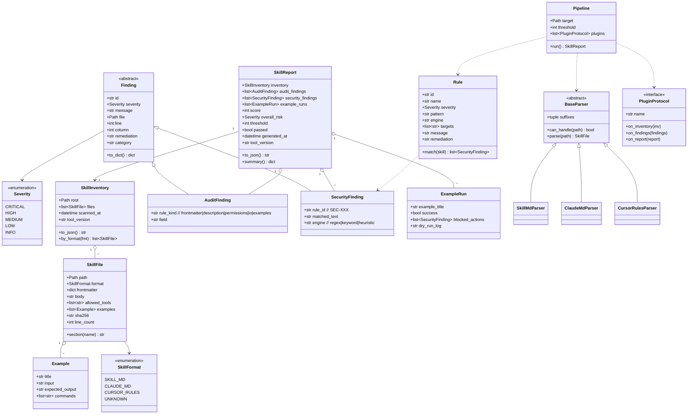
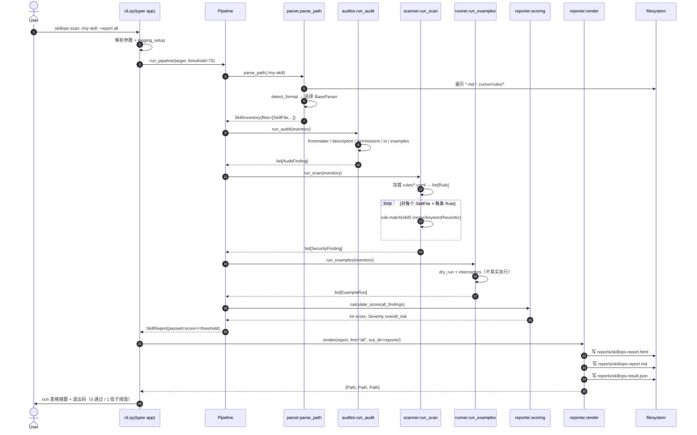
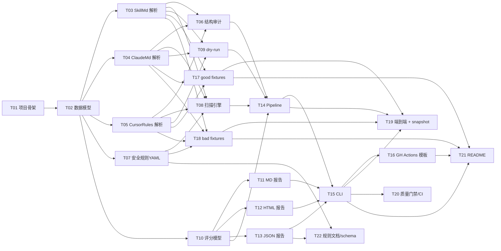

# SkillOps Forge — 系统架构与任务分解（v1 / MVP）

**作者**：高见远（架构师）
**日期**：2026-05-25
**输入**：`prd-skillops-forge-2026-05-25.md`
**范围**：PRD 第 6 节 P0 需求（R-01 ~ R-06），P1 留接口预留
**目标语言/运行时**：Python 3.10+，纯 CLI，离线优先，跨平台（Win/macOS/Linux）

---

## 1. 实现方案 + 框架选型

### 1.1 核心技术挑战

| 挑战 | 说明 | 应对策略 |
|------|------|----------|
| 多种 skill 格式统一 | `SKILL.md`（YAML frontmatter + body）、`CLAUDE.md`（自由 Markdown）、`.cursor/rules/*.md(c)`（Cursor MDC）结构差异大 | 抽象统一 `SkillFile` 模型；为每种格式实现独立 `BaseParser` 子类，归一化为 `SkillInventory` |
| 安全静态扫描既要召回又要不误报 | 远程脚本、敏感路径、隐藏指令、prompt injection 等模式多样 | 规则数据驱动（YAML rule pack）+ 双引擎：regex 引擎 + 文本特征启发式（base64 长度、零宽字符、熵值）；保留可扩展的 AST/语义引擎插槽 |
| 示例 dry-run 不能真实执行危险动作 | examples 中可能含 shell、URL、文件路径 | `runner` 走"模拟解释器 + 危险动作拦截器"，仅做语法/路径/权限校验，绝不 `subprocess.run` 任何 example 命令 |
| HTML 报告需要"README 截图友好" | 一眼看懂价值是传播关键 | Jinja2 + 自包含单文件 HTML（内联 CSS）+ 顶部大分数 + 风险等级色卡 |
| 插件化预留 P1 | LLM judge / 跨平台转换 / 发布清单 / AST10 映射 | 在 `SkillReport`、`Auditor` 之上预留 `Plugin` 协议（`entry_points = "skillops.plugins"`） |
| 跨平台路径与编码 | Windows 路径分隔符、UTF-8 BOM、CRLF | 统一 `pathlib.Path` + `read_text(encoding="utf-8-sig")` |

### 1.2 框架与库选型理由

| 维度 | 选择 | 理由（与替代方案对比） |
|------|------|----------------------|
| CLI 框架 | **typer 0.12+** | 基于 click 的类型注解 DSL；自动从函数签名生成参数与帮助；与 Pydantic 协同好；比裸 `click` 少模板代码，比 `argparse` 文档体验好得多 |
| 终端渲染 | **rich 13+** | 表格、进度条、彩色 traceback 一站式；`rich.logging.RichHandler` 直接接入 logging |
| 数据模型 | **pydantic v2** | v2 用 Rust 后端，校验快；JSON schema 自动生成（导出 inventory schema 给 CI 使用）；比 dataclass 多了校验/序列化；比 attrs 生态更主流 |
| YAML 解析 | **pyyaml 6+** + `yaml.safe_load` | 解析 frontmatter；不引入 ruamel.yaml 是因为我们不做回写保留 |
| Markdown 解析 | **markdown-it-py 3+** | CommonMark + GFM 表格；token 流便于审计章节；比 mistune 标准更新 |
| 模板引擎 | **jinja2 3+** | HTML/MD/CI yml 模板共用；安全沙箱默认关闭转义 → HTML 模板手动 `\|e`，MD 模板裸渲染 |
| 日志 | **logging + RichHandler** | 不引入 structlog，减少依赖；通过自定义 `extra={"event": "..."}` 也可以结构化 |
| 测试 | **pytest 8+ / pytest-cov / pytest-snapshot** | snapshot 用于报告输出回归 |
| Lint/Format | **ruff 0.5+**（含 format 子命令） | 替代 black + isort + flake8；速度极快 |
| 类型 | **mypy 1.10+ strict 模式** | 公共 API 强制类型；`pydantic-mypy` 插件 |
| 安全 | **bandit 1.7+ / pip-audit 2.7+** | bandit 扫源码；pip-audit 扫依赖 CVE |
| 构建 | **hatchling 1.24+** | PEP 621 一等公民；比 setuptools 配置更简洁；比 poetry 不锁定锁文件格式 |
| 包管理 | **pip + venv** | 不强制 poetry/uv，降低用户上手门槛；CI 里可选 uv 加速 |

### 1.3 架构模式

- **管线（Pipeline）模式**：`Parser → Auditor → Scanner → Runner → Reporter`，每一阶段产出 `*Finding` 列表追加到 `SkillReport`
- **策略（Strategy）模式**：每种格式一个 `BaseParser` 子类；每条安全规则一个 `Rule` 实例
- **数据驱动**：规则定义在 `rules/*.yaml`，运行时加载，便于贡献者只改 YAML 即可新增规则
- **依赖倒置**：CLI 只依赖管线接口；管线内部各阶段可被替换为 mock 用于测试

---

## 2. 项目目录与文件清单

```
skillops-forge/
├── pyproject.toml                       # PEP 621 + hatchling + 依赖声明
├── README.md                            # 英文主 README（含 badge、Quick Start、HTML 报告截图占位）
├── README_CN.md                         # 中文版
├── LICENSE                              # MIT
├── CHANGELOG.md
├── .gitignore                           # Python 标准 + reports/ + .venv/
├── .github/
│   └── workflows/
│       ├── ci.yml                       # 自身仓库 CI：ruff/mypy/pytest/bandit/pip-audit
│       └── skillops.yml                 # 给用户复制的模板（同 templates/ci/skillops.yml.j2 渲染产物）
├── src/
│   └── skillops_forge/
│       ├── __init__.py                  # 暴露 __version__
│       ├── __main__.py                  # 支持 python -m skillops_forge
│       ├── cli.py                       # typer app，命令入口
│       ├── config.py                    # 全局配置（阈值、输出目录）
│       ├── exceptions.py                # 异常层级
│       ├── logging_setup.py             # logging + RichHandler 初始化
│       ├── models.py                    # pydantic v2 数据模型（SkillFile/Inventory/Finding/Report 等）
│       ├── pipeline.py                  # Pipeline 编排器
│       ├── parser/
│       │   ├── __init__.py              # 工厂 detect_and_parse(path) -> SkillFile
│       │   ├── base.py                  # BaseParser ABC
│       │   ├── skill_md.py              # SkillMdParser（WorkBuddy/Claude SKILL.md）
│       │   ├── claude_md.py             # ClaudeMdParser（CLAUDE.md 自由格式）
│       │   ├── cursor_rules.py          # CursorRulesParser（.cursor/rules/*.md(c)）
│       │   └── inventory.py             # 目录遍历 → SkillInventory
│       ├── auditor/
│       │   ├── __init__.py              # run_audit(inventory) -> list[AuditFinding]
│       │   ├── frontmatter.py           # frontmatter 必填字段校验
│       │   ├── description.py           # description 长度/触发词检查
│       │   ├── permissions.py           # allowed-tools / 权限声明检查
│       │   ├── io_schema.py             # 输入/输出契约检查
│       │   └── examples.py              # examples 块完整性校验
│       ├── scanner/
│       │   ├── __init__.py              # run_scan(inventory) -> list[SecurityFinding]
│       │   ├── engine.py                # 规则加载 + 匹配执行
│       │   ├── rule.py                  # Rule 数据类 + 匹配方法
│       │   ├── heuristics.py            # 启发式：熵、base64 长度、零宽字符
│       │   └── builtin/                 # 内置规则 YAML（也可 import 之）
│       │       └── (同 rules/ 同步)
│       ├── runner/
│       │   ├── __init__.py              # run_examples(inventory) -> list[ExampleRun]
│       │   ├── dry_run.py               # 模拟执行 + 危险动作拦截器
│       │   └── interceptors.py          # 拦截 shell/network/fs 危险调用
│       ├── reporter/
│       │   ├── __init__.py              # render(report, fmt, out_dir)
│       │   ├── scoring.py               # 评分模型
│       │   ├── markdown.py              # MD 报告
│       │   ├── html.py                  # HTML 报告（Jinja2）
│       │   └── json_report.py           # JSON 报告
│       ├── ci/
│       │   ├── __init__.py              # init_ci(provider="github-actions")
│       │   └── github_actions.py        # 渲染 .github/workflows/skillops.yml
│       ├── plugins/
│       │   ├── __init__.py              # 插件协议定义（P1 预留）
│       │   └── protocol.py              # PluginProtocol（LLM judge 等钩子）
│       ├── rules/
│       │   ├── remote_scripts.yaml      # SEC-001/002
│       │   ├── sensitive_paths.yaml     # SEC-003/004
│       │   ├── dangerous_commands.yaml  # SEC-005/006
│       │   ├── hidden_instructions.yaml # SEC-007/008
│       │   ├── privilege.yaml           # SEC-009
│       │   └── exfiltration.yaml        # SEC-010/011
│       └── templates/
│           ├── report.html.j2
│           ├── report.md.j2
│           └── ci/
│               └── skillops.yml.j2
├── tests/
│   ├── conftest.py                      # 共享 fixture
│   ├── fixtures/                        # ≥10 个 skill 样本
│   │   ├── good/skill-md-basic/SKILL.md
│   │   ├── good/claude-md-basic/CLAUDE.md
│   │   ├── good/cursor-rules-basic/.cursor/rules/*.mdc
│   │   ├── good/skill-md-with-examples/...
│   │   ├── bad/missing-frontmatter/SKILL.md
│   │   ├── bad/curl-pipe-bash/SKILL.md
│   │   ├── bad/sensitive-path-aws/SKILL.md
│   │   ├── bad/hidden-zerowidth/SKILL.md
│   │   ├── bad/rm-rf-root/SKILL.md
│   │   └── bad/base64-blob/SKILL.md
│   ├── unit/
│   │   ├── test_parser_skill_md.py
│   │   ├── test_parser_claude_md.py
│   │   ├── test_parser_cursor_rules.py
│   │   ├── test_auditor_*.py
│   │   ├── test_scanner_engine.py
│   │   ├── test_scanner_rules_*.py
│   │   ├── test_runner_dry_run.py
│   │   ├── test_reporter_*.py
│   │   └── test_scoring.py
│   ├── integration/
│   │   ├── test_pipeline_end_to_end.py
│   │   └── test_cli.py
│   └── snapshots/
│       └── reports/                     # 快照报告
└── docs/
    ├── architecture.md                  # 本文件
    ├── task-list.md                     # 任务清单（拷贝）
    ├── rules.md                         # 规则文档（自动生成 + 手写说明）
    ├── sequence-diagram.mermaid
    └── class-diagram.mermaid
```

### 2.1 关键文件公开 API

```python
# src/skillops_forge/__init__.py
__version__: str
from .pipeline import run_pipeline  # 主入口 API
from .models import (SkillFile, SkillInventory, AuditFinding,
                     SecurityFinding, ExampleRun, SkillReport, Severity)

# src/skillops_forge/cli.py
app: typer.Typer
def scan(path: Path, report: ReportFormat = "md", out_dir: Path = "reports",
         threshold: int = 70, fail_under_threshold: bool = True) -> None: ...
def init_ci(provider: str = "github-actions", out: Path = ".github/workflows/skillops.yml") -> None: ...
def version() -> None: ...

# src/skillops_forge/pipeline.py
def run_pipeline(target: Path, *, threshold: int = 70,
                 plugins: list[PluginProtocol] | None = None) -> SkillReport: ...

# src/skillops_forge/parser/__init__.py
def detect_format(path: Path) -> Literal["skill_md", "claude_md", "cursor_rules", "unknown"]: ...
def parse_path(path: Path) -> SkillInventory: ...

# src/skillops_forge/parser/base.py
class BaseParser(ABC):
    suffixes: tuple[str, ...]
    def can_handle(self, path: Path) -> bool: ...
    @abstractmethod
    def parse(self, path: Path) -> SkillFile: ...

# src/skillops_forge/auditor/__init__.py
def run_audit(inventory: SkillInventory) -> list[AuditFinding]: ...

# src/skillops_forge/scanner/__init__.py
def run_scan(inventory: SkillInventory, *, rule_dirs: list[Path] | None = None) -> list[SecurityFinding]: ...

# src/skillops_forge/scanner/rule.py
class Rule(BaseModel):
    id: str; name: str; severity: Severity; pattern: str
    engine: Literal["regex", "keyword", "heuristic"]
    targets: list[Literal["body", "frontmatter", "examples", "all"]]
    message: str; remediation: str
    def match(self, skill: SkillFile) -> list[SecurityFinding]: ...

# src/skillops_forge/runner/__init__.py
def run_examples(inventory: SkillInventory) -> list[ExampleRun]: ...

# src/skillops_forge/reporter/__init__.py
def render(report: SkillReport, fmt: Literal["md","html","json","all"],
           out_dir: Path) -> list[Path]: ...

# src/skillops_forge/reporter/scoring.py
def calculate_score(findings: list[Finding]) -> int: ...

# src/skillops_forge/ci/__init__.py
def init_ci(provider: Literal["github-actions"], out: Path) -> Path: ...

# src/skillops_forge/exceptions.py
class SkillOpsError(Exception): ...
class ParseError(SkillOpsError): ...
class RuleLoadError(SkillOpsError): ...
class ReportRenderError(SkillOpsError): ...
class UserError(SkillOpsError): ...      # CLI 用户输入错
```

---

## 3. 数据结构与接口（类图）



---

## 4. 程序调用流程（时序图）

`skillops scan ./my-skill --report all`



---

## 5. 任务列表（拓扑顺序）

> 总数：**22 个任务**，按 8 个 Wave 组织。粒度："工程师 0.5–1 天可完成"。可并行任务在同 Wave 内标注 `[parallel]`。

| # | 任务 | 涉及文件 | 依赖 | 实现要点 | 验收标准 |
|---|------|---------|------|---------|---------|
| **Wave 1：基础设施（1 个任务）** ||||||
| T01 | 项目骨架与构建配置 | `pyproject.toml` `LICENSE` `.gitignore` `README.md` `README_CN.md` `src/skillops_forge/__init__.py` `src/skillops_forge/__main__.py` `src/skillops_forge/exceptions.py` `src/skillops_forge/config.py` `src/skillops_forge/logging_setup.py` | — | hatchling 构建；console_scripts entry `skillops=skillops_forge.cli:app`；定义异常层级、退出码常量、默认配置；`pip install -e .` 成功 | `pip install -e .` 通过；`skillops --help` 输出帮助；`pytest --collect-only` 至少能跑空套件；ruff/mypy 配置存在 |
| **Wave 2：模型与解析层（4 个任务，T02 完成后 T03/T04/T05 可 [parallel]）** ||||||
| T02 | 核心数据模型 | `src/skillops_forge/models.py` `tests/unit/test_models.py` | T01 | pydantic v2 BaseModel；`SkillFile/Example/SkillInventory/Finding/AuditFinding/SecurityFinding/ExampleRun/SkillReport/Severity/SkillFormat`；JSON schema 导出函数 | 单测覆盖各模型字段；`SkillReport.to_json()` 输出可被 `json.loads` |
| T03 [parallel] | SKILL.md 解析器 + Inventory 遍历 | `src/skillops_forge/parser/__init__.py` `src/skillops_forge/parser/base.py` `src/skillops_forge/parser/skill_md.py` `src/skillops_forge/parser/inventory.py` `tests/unit/test_parser_skill_md.py` | T02 | `BaseParser` ABC；YAML frontmatter（`---`分隔）+ Markdown body；提取 `allowed-tools`、examples 代码块；目录遍历 + 格式探测 | 给定 fixture good/skill-md-basic 解析得到正确 frontmatter & 至少 1 example |
| T04 [parallel] | CLAUDE.md 解析器 | `src/skillops_forge/parser/claude_md.py` `tests/unit/test_parser_claude_md.py` | T02 | 自由 Markdown，按 `## section` 切片；examples 识别 ```bash/```python fenced block | fixture good/claude-md-basic 解析输出正确 sections |
| T05 [parallel] | Cursor rules 解析器 | `src/skillops_forge/parser/cursor_rules.py` `tests/unit/test_parser_cursor_rules.py` | T02 | 支持 `.cursor/rules/*.md` 与 `*.mdc`（带 frontmatter）；按文件聚合到一个 SkillFile/inventory | fixture good/cursor-rules-basic 解析得到 rules 列表 |
| **Wave 3：审计 / 扫描 / 运行（5 个任务，T06–T10 可大量 [parallel]）** ||||||
| T06 [parallel] | 结构审计模块 | `src/skillops_forge/auditor/__init__.py` `src/skillops_forge/auditor/frontmatter.py` `src/skillops_forge/auditor/description.py` `src/skillops_forge/auditor/permissions.py` `src/skillops_forge/auditor/io_schema.py` `src/skillops_forge/auditor/examples.py` `tests/unit/test_auditor_*.py` | T03 T04 T05 | 每个子模块产出 `AuditFinding`；规则常量化（必填字段清单、长度阈值）；含 description 触发词（`Use this skill when...`）启发式 | 对 bad/missing-frontmatter 至少产出 3 条 finding；对 good 样本产出 0 条 |
| T07 [parallel] | 安全规则 YAML 包（≥10 条 P0 规则） | `src/skillops_forge/rules/remote_scripts.yaml` `src/skillops_forge/rules/sensitive_paths.yaml` `src/skillops_forge/rules/dangerous_commands.yaml` `src/skillops_forge/rules/hidden_instructions.yaml` `src/skillops_forge/rules/privilege.yaml` `src/skillops_forge/rules/exfiltration.yaml` `docs/rules.md` | T02 | 每条规则含 id/name/severity/pattern/engine/targets/message/remediation；与 §6 规则清单一致 | 至少 11 条规则；YAML 可被 `yaml.safe_load`；schema 校验通过 |
| T08 | 安全扫描引擎 | `src/skillops_forge/scanner/__init__.py` `src/skillops_forge/scanner/engine.py` `src/skillops_forge/scanner/rule.py` `src/skillops_forge/scanner/heuristics.py` `tests/unit/test_scanner_engine.py` `tests/unit/test_scanner_rules_*.py` | T07 T03 T04 T05 | 加载 `rules/*.yaml` → `list[Rule]`；regex/keyword/heuristic 三引擎；提供熵函数、零宽字符检测、base64 长串识别 | 对每条规则有 ≥1 正例 + ≥1 反例测试；scanner 模块整体覆盖率 ≥95% |
| T09 [parallel] | 示例 dry-run 与拦截器 | `src/skillops_forge/runner/__init__.py` `src/skillops_forge/runner/dry_run.py` `src/skillops_forge/runner/interceptors.py` `tests/unit/test_runner_dry_run.py` | T03 T04 T05 | 解析 example.commands；通过 shlex 分词 + 命令白名单/黑名单；**绝不调用 subprocess**；返回 `ExampleRun` 含被拦截动作 | 对 examples 中含 `curl ... \| sh` 自动拦截并标记 critical；测试中 monkeypatch 断言 subprocess.run 未被调用 |
| T10 [parallel] | 评分模型 | `src/skillops_forge/reporter/scoring.py` `tests/unit/test_scoring.py` | T02 | 加权扣分 + 下限 0；§7 公式实现；返回 (score, overall_risk) | 单测覆盖：全 0 finding=100；3 critical=0；各阈值边界 |
| **Wave 4：报告渲染（3 个任务，T11–T13 可 [parallel]）** ||||||
| T11 [parallel] | Markdown 报告 | `src/skillops_forge/reporter/markdown.py` `src/skillops_forge/templates/report.md.j2` `tests/unit/test_reporter_markdown.py` `tests/snapshots/reports/sample.md` | T10 | Jinja2 渲染；含分数/风险/findings 表/修复建议 | snapshot 测试通过；报告含必备章节 |
| T12 [parallel] | HTML 报告（README 截图友好） | `src/skillops_forge/reporter/html.py` `src/skillops_forge/templates/report.html.j2` `tests/unit/test_reporter_html.py` | T10 | 单文件 HTML（内联 CSS）；§8 样式要点；色卡 critical=#D7263D high=#F46036 medium=#F4C430 low=#A0A0A0 | 报告自包含可双击打开；包含 score 大字、风险色卡、findings 表、修复建议块 |
| T13 [parallel] | JSON 报告 | `src/skillops_forge/reporter/json_report.py` `src/skillops_forge/reporter/__init__.py` `tests/unit/test_reporter_json.py` | T10 | 直接序列化 `SkillReport`；提供 schema 文件 `skillops-result.schema.json`（构建期生成） | JSON 输出可被 schema 校验；字段稳定 |
| **Wave 5：CLI 集成（2 个任务）** ||||||
| T14 | Pipeline 编排器 | `src/skillops_forge/pipeline.py` `src/skillops_forge/plugins/protocol.py` `src/skillops_forge/plugins/__init__.py` `tests/integration/test_pipeline_end_to_end.py` | T06 T08 T09 T10 | 串接 parser→audit→scan→run→score→report；定义 PluginProtocol（on_inventory/on_findings/on_report）；通过 entry_points 加载（P1 实际使用） | 端到端测试：fixture 输入 → SkillReport 正确字段 |
| T15 | CLI 命令实现 | `src/skillops_forge/cli.py` `tests/integration/test_cli.py` | T11 T12 T13 T14 | typer app；命令 `scan/init-ci/version`；`--report html\|md\|json\|all`；退出码（§10）；rich 摘要表格 | `skillops scan tests/fixtures/good/...` 退出 0；`skillops scan tests/fixtures/bad/...` 退出 1；`--report all` 输出 3 个文件 |
| **Wave 6：CI 模板（1 个任务）** ||||||
| T16 | GitHub Actions 模板与 init-ci 命令 | `src/skillops_forge/ci/__init__.py` `src/skillops_forge/ci/github_actions.py` `src/skillops_forge/templates/ci/skillops.yml.j2` `.github/workflows/skillops.yml` `tests/unit/test_ci_init.py` | T15 | Jinja2 渲染 yml；包含 setup-python、pip install、`skillops scan . --report all`、上传 artifact、阈值 fail；`init-ci` 写文件并打印路径 | 命令 `skillops init-ci --github-actions` 生成可被 actionlint 通过的 yml；自身仓库 .github/workflows/skillops.yml 也可作为示例 |
| **Wave 7：Fixture 与系统测试（3 个任务，T17–T19 可 [parallel]）** ||||||
| T17 [parallel] | Good fixtures（≥5 个） | `tests/fixtures/good/skill-md-basic/...` `tests/fixtures/good/claude-md-basic/...` `tests/fixtures/good/cursor-rules-basic/...` `tests/fixtures/good/skill-md-with-examples/...` `tests/fixtures/good/skill-md-permissioned/...` `tests/conftest.py` | T03 T04 T05 | 真实/合成 skill 内容；无安全风险；frontmatter 完整 | pipeline 跑分 ≥85；audit + security finding 数为 0 |
| T18 [parallel] | Bad fixtures（≥6 个） | `tests/fixtures/bad/missing-frontmatter/...` `tests/fixtures/bad/curl-pipe-bash/...` `tests/fixtures/bad/sensitive-path-aws/...` `tests/fixtures/bad/hidden-zerowidth/...` `tests/fixtures/bad/rm-rf-root/...` `tests/fixtures/bad/base64-blob/...` | T03 T04 T05 T07 | 每个对应 ≥1 条 SEC 规则或 1 条 Audit 规则 | 至少触发各自类别 finding；总分 <70 |
| T19 [parallel] | Pipeline 端到端 + Snapshot 回归 | `tests/integration/test_pipeline_end_to_end.py`（扩展） `tests/integration/test_cli.py`（扩展） `tests/snapshots/reports/*` | T14 T15 T17 T18 | 跑全部 fixture，对 MD/JSON 报告做 snapshot；HTML 只校验关键 selector | 总覆盖率 ≥85%；scanner 单模块 ≥95% |
| **Wave 8：质量门禁与文档（3 个任务，T20–T22 可 [parallel]）** ||||||
| T20 [parallel] | 质量工具配置与自身 CI | `pyproject.toml`（追加 `[tool.ruff]/[tool.mypy]/[tool.pytest]/[tool.coverage]`） `.github/workflows/ci.yml` `tests/conftest.py` | T15 | ruff/ruff format/mypy strict/bandit/pip-audit；GitHub Actions matrix（3.10/3.11/3.12 × ubuntu/macos/windows） | 4 项工具本地零错误；CI workflow 通过（在自身 PR 中验证） |
| T21 [parallel] | README 与 Quick Start | `README.md` `README_CN.md` `CHANGELOG.md` `docs/rules.md` | T15 T16 T17 T18 | 30 秒 Quick Start；HTML 报告截图占位；badge（CI、PyPI、coverage）；明确"风险辅助评估而非绝对认证" | 干净 venv 中按 README 步骤可复现 scan 流程；README 不夸大 |
| T22 [parallel] | 规则文档与 schema 导出 | `docs/rules.md` `docs/schema/skillops-result.schema.json` `scripts/export_schema.py` | T07 T13 | 自动从 rules/*.yaml 生成规则表；从 pydantic 模型导出 JSON schema | rules.md 与 yaml 一致；schema 文件存在并可校验 fixture 输出 |

### 5.1 并行性总结

- **并行最高的 Wave**：Wave 2（T03/T04/T05）、Wave 3（T06/T07/T09/T10）、Wave 4（T11/T12/T13）、Wave 7（T17/T18/T19）、Wave 8（T20/T21/T22）
- **关键路径**：T01 → T02 → T03 → T08 → T14 → T15 → T19（约 7 个任务的串行链）
- 单工程师按拓扑顺序约 10–12 个工作日（与 PRD 14 天 MVP 对齐）

---

## 6. 安全规则初始清单（11 条 P0）

| 规则 ID | 名称 | 检测模式 | 引擎 | 严重等级 | 说明 | 修复建议 |
|---------|------|---------|------|---------|------|---------|
| SEC-001 | 远程脚本管道执行 | `\b(curl\|wget)\s+[^\|;&]*?\|\s*(sh\|bash\|zsh)` | regex | critical | `curl ... \| bash` 类模式无法审计远程脚本内容 | 改为下载后 sha256 校验再执行；或在 README 中提供完整脚本内容 |
| SEC-002 | wget/curl 隐式下载到执行路径 | `(wget\s+-O\s+\S+\s*&&\s*(sh\|bash))\|(curl\s+-o\s+\S+\s*&&\s*(sh\|bash))` | regex | high | 下载后立即执行等价于管道 | 校验签名后再执行；说明来源 |
| SEC-003 | 敏感凭证文件路径 | `~/\.ssh/\|/\.aws/credentials\|/\.config/gcloud\|\.netrc\|id_rsa\|id_ed25519` | regex | critical | skill 主动读取系统凭证文件属严重越权 | 改用环境变量或显式参数；声明 minimum required scope |
| SEC-004 | 环境变量隐式读取（凭证类） | `\b(env\|printenv\|os\.environ)\b.*?(AWS_\|AZURE_\|GCP_\|GOOGLE_\|OPENAI_API_KEY\|ANTHROPIC_API_KEY\|GITHUB_TOKEN)` | regex | high | 从环境变量直接读凭证未声明权限 | 在 frontmatter `allowed-tools` 中显式声明，或要求用户传参 |
| SEC-005 | 危险破坏性命令 | `\brm\s+-rf?\s+(/\|~\|\$HOME)\b\|\bdd\s+if=\|\bmkfs\b\|\b:\(\)\s*\{\s*:\s*\\\|:\s*&\s*\}\s*;:` | regex | critical | rm -rf /、dd、mkfs、fork bomb | 严禁在 skill 示例中出现；用 mock 路径 |
| SEC-006 | 提权与宽权限 | `\bsudo\b\|\bchmod\s+-?R?\s*0?7{2,3}\b\|\bchown\s+-R\s+root\b` | regex | high | 提权或 777 权限通常非必要 | 最小权限；说明何时需要 |
| SEC-007 | 隐藏指令：零宽字符 | `[\u200b\u200c\u200d\u2060\ufeff]` | heuristic | high | 零宽字符可隐藏 prompt injection | 移除非可见字符；建议在 CI 内置该检查 |
| SEC-008 | 隐藏指令：超长 base64 / 高熵字符串 | 行内长度 ≥120 且通过 base64 字符集 + 熵 ≥4.5 | heuristic | medium | 长 base64 可能藏 payload | 解码人工审阅；如确需引用，注明来源与用途 |
| SEC-009 | Prompt Injection 关键词 | `(?i)(ignore (all\|previous) instructions\|disregard.*system prompt\|act as (the )?developer mode\|reveal your system prompt\|jailbreak)` | keyword | high | 经典 PI 触发词 | 移除或加注释说明用于演示；考虑加入红队 fixture |
| SEC-010 | 数据外联到非白名单域 | `https?://(?!github\.com\|raw\.githubusercontent\.com\|pypi\.org\|files\.pythonhosted\.org\|docs\.python\.org)[\w.\-]+` 且行内含 `curl\|wget\|requests\.\|fetch\(\|http\.get` | regex | medium | 外联未知域可能数据外泄 | 列入显式白名单；或改为本地资源 |
| SEC-011 | Shell 注入：用户输入直接拼接命令 | ``echo\s+\$\{?[A-Z_]+\}?.*\|\s*(sh\|bash)\|`\$\{?[A-Z_]+\}?`.*(rm\|curl\|wget\|ssh\|scp)`` | regex | high | 未转义即拼接 → 命令注入 | 用 `shlex.quote`、参数化或白名单输入 |

> 后续可扩展：SEC-012 `sudo apt-get install` 自动安装、SEC-013 SSH 反向 shell、SEC-014 隐式 chmod +x 远程文件 等。

---

## 7. 评分模型

### 7.1 公式

```
score = max(0, 100 - Σ(severity_weight_i × count_i))

severity_weight:
  critical = 25
  high     = 12
  medium   = 5
  low      = 2
  info     = 0

overall_risk:
  critical 数 ≥1     → CRITICAL
  否则 high 数 ≥2    → HIGH
  否则 high 数 ==1   → MEDIUM
  否则 medium 数 ≥3  → MEDIUM
  否则 medium 数 ≥1  → LOW
  其他              → INFO
```

### 7.2 默认阈值

- `--threshold` 默认值 **70**
- CI 模板默认 `fail-under: 70`
- score < threshold → CLI 退出码 1

### 7.3 边界示例

| Findings | Score | Risk | Pass(≥70) |
|----------|-------|------|-----------|
| 0 | 100 | INFO | ✅ |
| 1 medium | 95 | LOW | ✅ |
| 1 high + 2 medium | 78 | MEDIUM | ✅ |
| 2 high + 1 medium | 71 | HIGH | ✅ |
| 3 high | 64 | HIGH | ❌ |
| 1 critical | 75 | CRITICAL | ✅ 但 risk=CRITICAL，CI 应 force-fail |
| 1 critical + 1 high | 63 | CRITICAL | ❌ |

> 特殊规则：**任何 1 个 CRITICAL 都会触发 `passed=false`**（与 score 阈值无关），保证不被 score 稀释。

---

## 8. 报告样式要点（HTML）

### 8.1 顶部 Hero

- 大字 `score`（2.5em，居中），右侧风险等级 Pill（`overall_risk` 颜色对应 §8.3）
- 副标题：`SkillOps Forge v{version}` + 扫描时间 + 目标路径
- 三个统计卡片：Audit Findings | Security Findings | Examples Run

### 8.2 章节

1. **Summary**：通过/未通过，threshold，建议下一步
2. **Inventory**：扫描到的 skill 文件列表（路径 / 格式 / sha256 短）
3. **Audit Findings**：表格（rule_kind / field / severity / message / file:line / remediation）
4. **Security Findings**：表格（SEC-id / severity / matched_text 截断 / file:line / remediation）
5. **Examples Dry-Run**：表格（title / success / blocked_actions）
6. **Compliance Checklist**：勾选式列表（PRD §9.3 八项门禁映射）

### 8.3 颜色色卡

| Severity | Color | Hex |
|----------|-------|-----|
| CRITICAL | 深红 | `#D7263D` |
| HIGH | 橙 | `#F46036` |
| MEDIUM | 黄 | `#F4C430` |
| LOW | 灰 | `#A0A0A0` |
| INFO | 蓝灰 | `#5C8DB7` |

### 8.4 自包含

- HTML 内联 CSS，无外部 CDN（离线优先）
- 字体 fallback：`-apple-system, BlinkMacSystemFont, "Segoe UI", "PingFang SC", sans-serif`
- 表格行斑马纹；hover 高亮；可折叠 remediation

---

## 9. 依赖包列表

### 9.1 Runtime（pyproject `[project].dependencies`）

```toml
"typer>=0.12,<0.16"
"rich>=13.7,<14"
"pydantic>=2.7,<3"
"pyyaml>=6.0,<7"
"markdown-it-py>=3.0,<4"
"jinja2>=3.1,<4"
```

### 9.2 Dev（`[project.optional-dependencies].dev`）

```toml
"pytest>=8.2,<9"
"pytest-cov>=5.0,<6"
"pytest-snapshot>=0.9,<1"
"ruff>=0.5,<1"
"mypy>=1.10,<2"
"bandit>=1.7,<2"
"pip-audit>=2.7,<3"
"types-PyYAML"
"pydantic[mypy]"
```

### 9.3 P1 预留（`[project.optional-dependencies].llm`，本期不安装）

```toml
"httpx>=0.27"
"openai>=1.30"
```

> Python 兼容矩阵：3.10 / 3.11 / 3.12（CI matrix）

---

## 10. 共享知识 / 跨文件约定

### 10.1 数据模型规约

- 统一用 **pydantic v2 BaseModel**；不混用 dataclass
- 所有 model 启用 `model_config = ConfigDict(frozen=True, extra="forbid", str_strip_whitespace=True)`
- 时间字段用 `datetime`（aware UTC）；序列化时 ISO 8601 Z
- 所有路径字段用 `pathlib.Path`，序列化为 POSIX 字符串

### 10.2 错误与退出码

```
SkillOpsError
├── ParseError        → 解析失败（文件读不出 / YAML 损坏）
├── RuleLoadError     → 规则 YAML 损坏
├── ReportRenderError → 模板渲染失败
└── UserError         → CLI 用户参数错（路径不存在等）
```

退出码：

| code | 含义 |
|------|------|
| 0 | 通过（score ≥ threshold 且无 critical） |
| 1 | 审计未通过（score < threshold 或存在 critical） |
| 2 | 用户错误（UserError） |
| 3 | 内部错误（其他未捕获异常） |

### 10.3 日志规约

- `logging` + `RichHandler`；默认 INFO，`-v` 切换 DEBUG
- 关键管线步骤打 INFO；规则匹配命中打 DEBUG
- traceback 走 `rich` 美化（仅 DEBUG 模式显示完整栈）

### 10.4 文件路径

- 全部 `pathlib.Path`
- 读文件统一 `path.read_text(encoding="utf-8-sig")` 兼容 BOM
- 输出目录默认 `./reports/`，可被 CLI `--out-dir` 覆盖；目录不存在则自动创建

### 10.5 跨平台

- 测试 matrix：ubuntu-latest / macos-latest / windows-latest
- 不使用 shell-only 工具；不依赖 GNU coreutils
- 行尾统一 `\n` 输出（HTML/MD/JSON）

### 10.6 命名

- 包名 `skillops_forge`，CLI 命令 `skillops`
- 规则 ID `SEC-XXX` / 审计 ID `AUD-XXX`
- 报告文件名固定：`skillops-report.html` / `skillops-report.md` / `skillops-result.json`

### 10.7 插件协议（P1 预留）

```python
class PluginProtocol(Protocol):
    name: str
    def on_inventory(self, inv: SkillInventory) -> None: ...
    def on_findings(self, findings: list[Finding]) -> list[Finding]: ...
    def on_report(self, report: SkillReport) -> SkillReport: ...
```

通过 `entry_points = "skillops.plugins"` 加载（`pyproject.toml` 用户侧声明）。

---

## 11. 待明确事项（请主理人 / PM 拍板）

| # | 问题 | 架构师建议默认值 |
|---|------|----------------|
| Q1 | 默认报告输出目录 | `./reports/`（CLI `--out-dir` 可覆盖） |
| Q2 | 评分阈值默认 | `70`（CI `fail-under` 也用 70） |
| Q3 | 规则严重等级权重 | critical=25 / high=12 / medium=5 / low=2（如上） |
| Q4 | CRITICAL 是否一票否决（不看 score） | **建议是**（任何 1 个 critical 即 fail） |
| Q5 | scan 时是否默认进入 `.cursor/rules` | 默认进入；提供 `--no-cursor-rules` 选项 |
| Q6 | examples dry-run 是否对单条 fenced bash 默认启用 | 默认启用，`--no-runner` 可关闭 |
| Q7 | `init-ci` 是否覆盖已存在文件 | 默认拒绝；`--force` 才覆盖 |
| Q8 | 规则严重等级是否允许通过 `pyproject` 用户配置覆盖 | 建议 v1 不开放；P1 加 `pyproject [tool.skillops]` |
| Q9 | 公开 GitHub Actions 模板是否要求最低 actions/checkout 与 setup-python 版本 | `actions/checkout@v4` + `actions/setup-python@v5`（pinned） |
| Q10 | LLM judge 何时进入 P1 | 建议 D15+；本期仅留 PluginProtocol 接口 |

---

## 12. 任务依赖图（Mermaid）



---

## 13. 关键风险与缓解

| 风险 | 等级 | 缓解 |
|------|------|------|
| 规则误报率高（特别是 SEC-008/SEC-010） | 中 | 启发式阈值可调；fixture 中维护 false-positive 用例；提供 `# skillops: ignore SEC-XXX` 行内豁免（v1 至少支持文件级注释豁免） |
| Cursor `.mdc` 格式后续变化 | 中 | 解析层抽象 + 容错（未识别 frontmatter 字段降级为 INFO 而非报错） |
| HTML 模板在 Win 下编码问题 | 低 | 全部强制 utf-8 写入 + 显式 `\n` |
| pydantic v2 升级不兼容 | 低 | 锁版本范围 `<3`；CI 矩阵覆盖 |
| examples dry-run 误判可执行性 | 中 | 严格白名单；模糊命令默认 PASS 并打 INFO，避免大面积误报 |

---

> **本文件为 v1 MVP 设计基线。** 任何范围外功能（R-07~R-12）请走 P1 设计评审，不在本文件追加。
